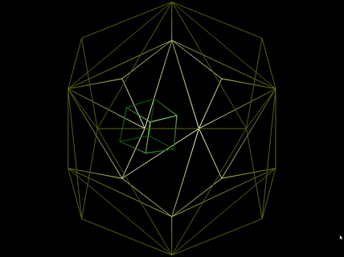

# Physically-based-modelling
This repository is a set of physics simulation projects developed as a part of CSCE 649: Physically-Based Modeling.

## Stable Fluids Simulation

2D fluid simulation using semi-lagrangian method and staggered grid for velocity interpolation. I have used conjugate gradient method with implicit matrix representation to solve for the field variables.

<b>References:</b> [Stable Fluids](https://dl.acm.org/citation.cfm?id=311548)

## Deformable Springy-Mesh Simulation

Springy mesh is basically consrtucted by replacing the edges with a spring-mass-damper system. In this simulation, I tried modeling a cloth (in the absense of gravity of-course). The close is basically modelled as a lattice of quadrilaterals with additional reinforcing structs for in-plane and out-of-plane rigidity. A simplefied collision detection and response is simulated with a sphere.

## Rigid Body Simulation

Simulation of a cuboid bouncing inside a Dodecahedron. Representation of the orientation of the rigid body is done using quarernions. Forgive my bad rendering skills.

## Flocking Behavior

Group behaviour of a flock of birds or school of fish, or insects is fascinating. However, it is interesting that modeling the same turns to be incredibly simple. Every individual follows a set of three simple rules guiding how it accelerates in response to the positions and velocities of its nearby neighbor individuals. The rules are (1) Collision Avoidance, (2) Velocity Matching, (3) Centering

This is a fun little game I created. The goal is to use the lead particle (colored red, controlled by keys) to direct the impatient insect group to the center of the spiral.

<b>References:</b> [Flocks, Herds, and Schools: A Distributed Behavioral Model](https://team.inria.fr/imagine/files/2014/10/flocks-hers-and-schools.pdf)

## Steering

This simulation shows the 'boids' steering around obstacles.

## Fireworks

A simple 3D particle animation with gravity and colors.

## Ball Collision

This is the basic simulation I started with. The ball is represented simply by its position. Collision detection and response are implemented. Gravity can be enabled/disabled. Wind can be controlled using keys.
